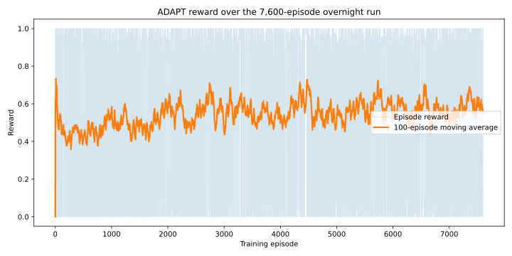
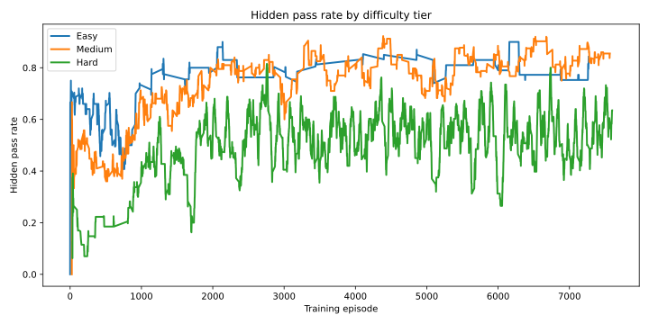
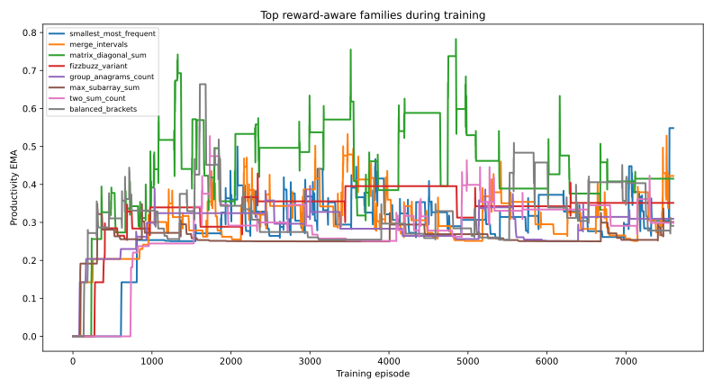

# ADAPT: Adversarial DSA Programming Tutor

LLMs are getting better at one-shot code generation, but they still struggle with the thing real engineers do all day: read feedback, debug, and repair. ADAPT closes that gap by turning algorithm practice into a self-repair RL environment where the model must improve over multiple attempts instead of guessing once.

## Submission links

- Hugging Face Space: [Dishaaa25/meta-rl-dsa-solver](https://huggingface.co/spaces/Dishaaa25/meta-rl-dsa-solver)
- Live environment: [Dishaaa25-meta-rl-dsa-solver.hf.space](https://Dishaaa25-meta-rl-dsa-solver.hf.space)
- Training repo URL: [Space repository root](https://huggingface.co/spaces/Dishaaa25/meta-rl-dsa-solver/tree/main)
- Training script: [training/train_grpo.py](https://huggingface.co/spaces/Dishaaa25/meta-rl-dsa-solver/blob/main/training/train_grpo.py)
- Training evidence: [TRAINING_EVIDENCE.md](https://huggingface.co/spaces/Dishaaa25/meta-rl-dsa-solver/blob/main/TRAINING_EVIDENCE.md)
- Mini blog / writeup: [BLOG.md](https://huggingface.co/spaces/Dishaaa25/meta-rl-dsa-solver/blob/main/BLOG.md)
- Trained adapter repo: [Dishaaa25/adapt-dsa-tutor-model](https://huggingface.co/Dishaaa25/adapt-dsa-tutor-model)
- Source repo mirror: [s-shah4/meta-rl-dsa-solver](https://github.com/s-shah4/meta-rl-dsa-solver)

## Why ADAPT exists

Most code-generation benchmarks test whether a model can land the answer immediately. They do not test whether the model can recover from partial failure, use examples productively, or adapt as the task distribution changes.

ADAPT is built to stress exactly those capabilities:

- adaptive difficulty across easy, medium, and hard DSA families
- visible examples plus hidden evaluation tests
- multi-step repair with feedback between attempts
- reward-aware problem generation that shifts toward the most educational families
- optional dataset-backed problem loading for competitive-programming style tasks

## Architecture

```text
+------------+     +-----------+     +----------+     +-----------+
| Generator  | --> | Problem   | --> | Solver   | --> | Execution |
+------------+     +-----------+     +----------+     +-----------+
      ^                                                        |
      |                                                        v
      +------------- Curriculum <- Reward <- Verification -----+
```

## What the agent sees, does, and gets rewarded for

The agent sees a plain-English programming problem, the stdin format, constraints, and two worked examples. It writes Python code that reads from stdin and prints to stdout.

The environment executes that code on 10 tests per problem:

- 2 visible tests shown as examples
- 8 hidden tests used for the real pass-rate reward

After each attempt, the environment returns:

- hidden pass rate
- visible pass rate
- execution status such as `completed`, `wrong_answer`, `runtime_error`, or `timeout`
- a compact list of which tests failed
- enough context to try again on the same problem

## Multi-step repair loop

Each episode allows up to 3 attempts on the same problem.

1. Attempt 1: the agent submits a first solution.
2. Feedback: ADAPT reports the current execution status, hidden pass rate, visible pass rate, and which visible/hidden tests failed.
3. Attempt 2 or 3: the agent repairs its code using that feedback.
4. The episode ends early if all hidden tests pass and the solution clears the efficiency target.

Concrete example:

```text
Problem family: running_total

Attempt 1 code:
print(sum(nums))

Feedback:
Attempt 1/3
Previous attempt status: ready
Current execution status: wrong_answer
Hidden pass rate: 0.25
Visible pass rate: 0.50
Failed tests:
- Visible test #2: wrong_answer (expected=5 3 10, got=10)
- Hidden test #1: wrong_answer
- Hidden test #4: wrong_answer

Attempt 2 code:
running = 0
for x in nums:
    running += x
    out.append(str(running))
print(" ".join(out))
```

That repair loop is the core novelty of ADAPT: the model is rewarded for debugging, not just for lucky first drafts.

## Reward function

ADAPT uses hidden correctness as the base signal, then folds in efficiency once a submission is fully correct:

```python
if execution_status in {"syntax_error", "safety_violation", "timeout"}:
    reward = 0.0
elif hidden_pass_rate == 1.0:
    reward = step_discount * (0.6 + 0.4 * efficiency_score)
elif done:
    reward = 0.0
else:
    reward = 0.1 * max(0.0, hidden_pass_rate - previous_hidden_pass_rate)
```

Where:

- `step_discount = 1.00` on attempt 1
- `step_discount = 0.85` on attempt 2
- `step_discount = 0.70` on attempt 3
- `efficiency_score` is computed from time and space signals in `verifier/complexity.py`
- early completion requires `hidden_pass_rate == 1.0` and `efficiency_score >= 0.89`

Additional shaping for the repair loop:

- if a failed non-terminal attempt improves hidden pass rate, reward = `0.1 * delta_pass_rate`
- if the final attempt still fails, reward = `0.0`
- timeouts, syntax errors, and safety violations always get `0.0`
- a fully-correct but still-suboptimal solution is capped below the terminal max until it meets the efficiency target

Examples:

- attempt 1 solves all 8 hidden tests: reward = `1.0`
- attempt 2 solves all 8 hidden tests: reward = `0.85`
- attempt 1 improves from `0.25` to `0.50` hidden pass rate on a retry trajectory: reward = `0.025`
- attempt 3 still fails: reward = `0.0`

### Efficiency signal

When there are at least three probe inputs with distinct size hints, ADAPT measures empirical runtime and memory growth by replaying the submission on a small subset of tests.

- probe inputs are deduplicated, sorted by a numeric size hint parsed from the first token of the first non-empty line, and capped at 5 probes
- if no numeric size hint is available, ADAPT falls back to raw input length
- empirical complexity falls back to the static AST heuristic if the probe run errors, times out, or lacks enough size variation
- this keeps the reward signal stable for standard competitive-programming inputs where the first integer usually represents problem size

## Problem families

ADAPT now covers 20 algorithmic families instead of a tiny fixed bank:

- Easy: `sum_even_numbers`, `range_span`, `count_vowels`, `max_consecutive_ones`, `fizzbuzz_variant`, `running_total`
- Medium: `count_local_peaks`, `longest_non_decreasing_run`, `two_sum_count`, `max_subarray_sum`, `group_anagrams_count`, `balanced_brackets`, `matrix_diagonal_sum`
- Hard: `smallest_most_frequent`, `reverse_words`, `longest_common_subsequence`, `word_ladder_steps`, `merge_intervals`, `min_coins`, `rotate_matrix_90`

Every family has:

- its own randomized case generator
- 2 visible example tests
- 8 hidden evaluation tests
- a reference solver that auto-generates expected outputs

## Dataset-backed mode

ADAPT can also sample problems from a dataset-backed bank, such as `deepmind/code_contests`, instead of the built-in template families.

- dataset rows are normalized into the same canonical schema used by the deterministic generator
- expected outputs are never truncated; rows with outputs longer than `4096` characters are rejected during normalization
- duplicate normalized inputs are rejected so dataset problems still satisfy the environment validator
- the end-to-end smoke test for this path lives in `scripts/test_dataset_mode.py`

## Self-improving curriculum

ADAPT uses one curriculum authority in training: the `CurriculumManager` inside `training/train_grpo.py`.

- promote threshold: `0.70`
- demote threshold: `0.30`
- moving-average window: `10` episodes

On top of that, the generator tracks `family_productivity`, an EMA of how educational each family is:

```text
family_productivity[family] = 0.9 * old + 0.1 * generator_reward
```

Families that produce pass rates near the learning sweet spot, around `0.5`, become more likely to be sampled via a softmax distribution. This creates a closed loop:

```text
productive families -> more samples -> better learning signal -> updated family productivity
```

That makes ADAPT more than a static benchmark. The environment actively searches for the problems that teach the model the most.

## Results

We ran a real overnight GRPO training job on `Qwen/Qwen2.5-3B-Instruct` and logged `7,600` training episodes over `950` optimizer steps.

Training run:

- Run ID: `15940d1d-7d8c-4253-8810-2ea934bedee4`
- Started: `2026-04-25 22:21 UTC`
- Finished: `2026-04-26 07:19 UTC`
- Wall-clock time: `8.96 hours`
- Train preset: `overnight`
- Curriculum mode: `reward_aware`
- Trained model revision: `6c957e7c6bdb25ff086775fb8692570aee4501c9`

Proof of learning from the actual run logs:

- Average reward improved from `0.4441` in the first `500` episodes to `0.5951` in the last `500` episodes.
- Average hidden pass rate improved from `0.4625` to `0.6488`.
- Completion rate improved from `43.6%` to `59.6%`.

Late-training performance over the final `500` episodes:

| Difficulty | Episodes | Avg reward | Avg hidden pass rate | Completion rate |
| --- | ---: | ---: | ---: | ---: |
| Easy | 32 | 0.8390 | 0.8477 | 84.38% |
| Medium | 104 | 0.7892 | 0.8425 | 78.85% |
| Hard | 364 | 0.5182 | 0.5759 | 51.92% |

### Reward curve



### Pass rate by difficulty



### Reward-aware family productivity



Top productive families near the end of training:

- `smallest_most_frequent`
- `merge_intervals`
- `matrix_diagonal_sum`
- `fizzbuzz_variant`
- `group_anagrams_count`
- `max_subarray_sum`
- `two_sum_count`
- `balanced_brackets`

### A concrete improvement story

This run did not include a separate baseline-eval sweep, so we do not claim a strict benchmark-style baseline-vs-trained score table. Instead, we show the model improving *inside the environment itself* over the same overnight run:

- early training is dominated by low-reward, low-pass-rate episodes and safety failures
- by the end of the run, the agent is regularly solving hard tasks like `reverse_words` with `reward=1.0`, `hidden pass rate=1.0`, and `efficiency score=1.0`

The raw summary used for the table above is stored in `artifacts/results_summary.json`.

For the hackathon submission form, the "Training Run Notebook URL" field can point to the public Hugging Face Space repository because this project trained directly on Hugging Face rather than from a separate Colab notebook. The repo includes:

- the full training entrypoint in `training/train_grpo.py`
- the recovered training evidence in `TRAINING_EVIDENCE.md`
- embedded reward / pass-rate plots committed as image files
- the lightweight structured summary in `artifacts/results_summary.json`

## How to run

### 1. Install dependencies

```powershell
cd C:\Users\kaust\PycharmProjects\meta-rl-dsa-solver
py -3.11 -m venv .venv
.\.venv\Scripts\pip install -e .
```

For training and plotting, also install your training extras:

```powershell
.\.venv\Scripts\pip install trl unsloth matplotlib wandb
```

Recommended training target:

- Python `3.11`
- Base model `Qwen/Qwen2.5-3B-Instruct`
- Single NVIDIA L4 with 4-bit LoRA + Unsloth GRPO

### 2. Start the OpenEnv server

```powershell
python server\app.py
```

### 3. Reset an environment session

```powershell
curl -X POST http://localhost:7860/reset ^
  -H "Content-Type: application/json" ^
  -d "{\"difficulty\":\"easy\"}"
```

The response includes a `session_id`. Reuse it for `step` and `state`.

### 4. Submit code to `/step`

```powershell
curl -X POST http://localhost:7860/step ^
  -H "Content-Type: application/json" ^
  -d "{\"session_id\":\"<SESSION_ID>\",\"code\":\"n=int(input())\nnums=list(map(int,input().split()))\nprint(sum(x for x in nums if x % 2 == 0))\"}"
```

### 5. Inspect current state

```powershell
curl "http://localhost:7860/state?session_id=<SESSION_ID>"
```

### 6. Run training

```powershell
python training\train_grpo.py ^
  --generator-mode reward_aware ^
  --baseline-eval ^
  --output-dir outputs_l4
```

To train against the dataset-backed bank instead of the local templates:

```powershell
python training\train_grpo.py ^
  --generator-mode reward_aware ^
  --use-dataset ^
  --dataset-name deepmind/code_contests ^
  --output-dir outputs_dataset
```

### 7. Plot the training curves

```powershell
python training\plot_results.py outputs_l4\reward_curve.csv
```

### 8. Run the dataset smoke test

```powershell
python scripts\test_dataset_mode.py
```

## Hugging Face Space

This repo is designed to be hosted as an OpenEnv FastAPI Space.

```powershell
openenv push --repo-id <your-hf-username>/adapt-dsa-tutor
```

### Quick test for the trained model

You can call the live Space directly to test the trained code-generation model without cloning the repo locally. The inference endpoint is:

```text
POST https://Dishaaa25-meta-rl-dsa-solver.hf.space/generate-code
```

#### Example 1: Two Sum

```bash
curl -X POST "https://Dishaaa25-meta-rl-dsa-solver.hf.space/generate-code" \
  -H "Content-Type: application/json" \
  -d '{
    "problem": "Given an array of integers nums and an integer target, return the indices of the two numbers such that they add up to target. You may assume exactly one solution exists, and you may not use the same element twice. Print the two zero-based indices separated by a space.",
    "input_format": "Line 1: integer n. Line 2: n space-separated integers nums[i]. Line 3: integer target.",
    "constraints": "2 <= n <= 100000. -10^9 <= nums[i], target <= 10^9. Exactly one valid answer exists.",
    "problem_id": "judge_two_sum",
    "problem_type": "array_hashing",
    "difficulty": "medium",
    "attempt_number": 1,
    "max_steps": 1,
    "max_new_tokens": 512
  }'
```

#### Example 2: Group Anagrams

```bash
curl -X POST "https://Dishaaa25-meta-rl-dsa-solver.hf.space/generate-code" \
  -H "Content-Type: application/json" \
  -d '{
    "problem": "Given a list of lowercase strings, group the anagrams together. Print one group per line. Within each group, print the words in sorted order separated by spaces. Print the groups ordered by the first word in each sorted group.",
    "input_format": "Line 1: integer n. Next n lines: one lowercase string per line.",
    "constraints": "1 <= n <= 10000. Each string length is between 1 and 100. Strings contain only lowercase English letters.",
    "problem_id": "judge_group_anagrams",
    "problem_type": "hashing_strings",
    "difficulty": "medium",
    "attempt_number": 1,
    "max_steps": 1,
    "max_new_tokens": 512
  }'
```

The response is JSON and includes the generated Python solution under the `code` field.

## Submission checklist

- OpenEnv environment with `Environment`, `reset`, `step`, and `state`
- valid `openenv.yaml`
- Hugging Face Space deployment
- GRPO training script with Unsloth + TRL
- reward and pass-rate plots from a real run
- baseline vs trained evaluation summary
- Colab notebook link for reproducibility

## Links

- Hugging Face Space URL: [https://huggingface.co/spaces/Dishaaa25/meta-rl-dsa-solver](https://huggingface.co/spaces/Dishaaa25/meta-rl-dsa-solver)
- Live app URL: [https://Dishaaa25-meta-rl-dsa-solver.hf.space](https://Dishaaa25-meta-rl-dsa-solver.hf.space)
- Training repo URL: [https://huggingface.co/spaces/Dishaaa25/meta-rl-dsa-solver/tree/main](https://huggingface.co/spaces/Dishaaa25/meta-rl-dsa-solver/tree/main)
- Training script URL: [https://huggingface.co/spaces/Dishaaa25/meta-rl-dsa-solver/blob/main/training/train_grpo.py](https://huggingface.co/spaces/Dishaaa25/meta-rl-dsa-solver/blob/main/training/train_grpo.py)
- Training evidence URL: [https://huggingface.co/spaces/Dishaaa25/meta-rl-dsa-solver/blob/main/TRAINING_EVIDENCE.md](https://huggingface.co/spaces/Dishaaa25/meta-rl-dsa-solver/blob/main/TRAINING_EVIDENCE.md)
- Blog post URL: [https://huggingface.co/spaces/Dishaaa25/meta-rl-dsa-solver/blob/main/BLOG.md](https://huggingface.co/spaces/Dishaaa25/meta-rl-dsa-solver/blob/main/BLOG.md)
- Trained model URL: [https://huggingface.co/Dishaaa25/adapt-dsa-tutor-model](https://huggingface.co/Dishaaa25/adapt-dsa-tutor-model)
